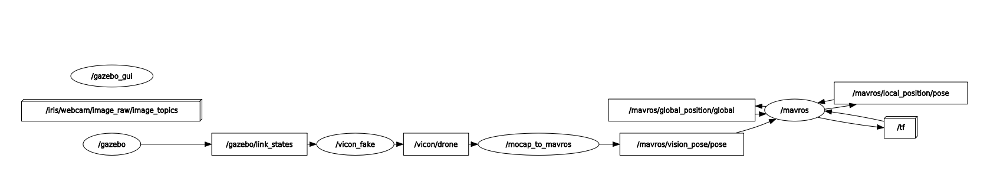

# Use of drone simulation tools
This tool pack is to simulate a single drone to test controllers using Mavros.

## Packages required
- **PX4**
- **Arducopter** not tested
- **mavros** for communicating with drones in ROS

## Packages
- **fake_vicon** for producing vicon/qualisys information
- **mocap_to_mavros** for feeding vision pose information to drone
- **drone_simulation_tools** provides launch files to call **fake_vicon** and **mocap_to_mavros**

## Use cases
### 1. PX4 in Gazebo + fake VICON + mavros + mocap_to_mavros
This is to simulate a drone with PX4 firmware in Gazebo and a VICON system that communicate with mavros. 

In other words, it porvides a simulation envrionment for using VICON in reality: fake VICON takes drone information from Gazebo and publishs to ROS topics.

By the way, feeding vision pose information to drone with **mocap_to_mavros** is because PX4 only allow OFFBOARD when vision_pose is feeded.

```shell
    roslaunch drone_simulation_tools drone_px4_onboard.launch
```
Then, we should see
<figure>
    
</figure>

which show topics and nodes
- gazebo simulates a PX4 drone
- node vicon_fake from **fake_vicon** subscribe to gazebo and pushes drone pose info to /vicon/drone
- node mocap_to_mavros from **mocap_to_mavros** feeds drone pose infor to /mavros/vision_pose
- **mavros** builds communication between ROS and drone


### 2. PX4 in Gazebo + GPS + mavros
This is to simulate using GPS for localisation and mavros for communication. GPS information is set by default in Px4 Gazebo simulation. 

So, in ```drone_px4_gps.launch```, we simply start PX4 in Gazebo and mavros by 
 
```shell
    roslaunch drone_simulation_tools drone_px4_gps.launch
```