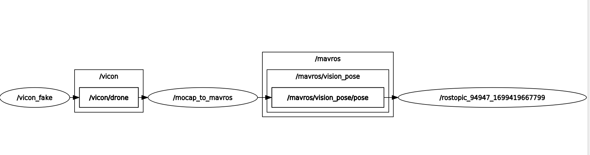

# Use of drone simulation tools
This tool pack is to simulate a single drone to test controllers using Mavros.

## Packages required
- **PX4**
- **Arducopter** not tested
- **mavros** for communicating with drones in ROS

## Packages
- **fake_qualisy** for producing vicon/qualisys information
- **mocap_to_mavros** for feeding vision pose information to drone
- **drone_simulation_tools** provides launch files to call **fake_qualisy** and **mocap_to_mavros**

## Use cases
### 1. PX4 in Gazebo + fake VICON + onboard nodes (mavros + mocap_to_mavros)
This is to simulate a drone with PX4 firmware in Gazebo and a VICON system that communicate with mavros. 

In other words, it porvides a simulation envrionment for using VICON in reality: fake VICON takes drone information from Gazebo and publishs to ROS topics.

By the way, feeding vision pose information to drone with **mocap_to_mavros** is because PX4 only allow OFFBOARD when vision_pose is feeded.

```shell
    roslaunch drone_simulation_tools drone_px4_onboard.launch
```
Then, we should see
<figure>
    
</figure>

which show topics and nodes
- gazebo simulates a PX4 drone
- node vicon_fake from **fake_qualisy** subscribe to gazebo and pushes drone pose info to /vicon/drone
- node mocap_to_mavros from **mocap_to_mavros** feeds drone pose infor to /mavros/vision_pose
- **mavros** builds communication between ROS and drone


### 2. fake VICON + mocap_to_mavros
This is to provide a faked VICON that we can specify the pose of drone.

It can be used for tests before flights:
- connect a drone to an onboard computer
- run fake VICON with custermised pose and mocap_to_mavros on the onboard computer
- test controllers on the onboard computer

1. fake VICON with predefined pose

fake a vicon system that publishes a drone's pose by
```shell
    roslaunch fake_qualisys fake_vicon_experiment.launch
```
where the pose can be set in fake_vicon_experiment.launch
```html
  <!-- drone position -->  
  <arg name="drone_post_x" default="0"/>
  <arg name="drone_post_y" default="0"/>
  <arg name="drone_post_z" default="1"/>
  <!-- drone attitude in quaterion -->
  <arg name="drone_att_q_x" default="0"/>
  <arg name="drone_att_q_y" default="0"/>
  <arg name="drone_att_q_z" default="0"/>
  <arg name="drone_att_q_w" default="1"/>
```
2. use onboard node to map mocap to mavros
```shell
    roslaunch mocap_to_mavros_sim mocap_to_mavros_sim.launch
```
<figure>
    
</figure>
